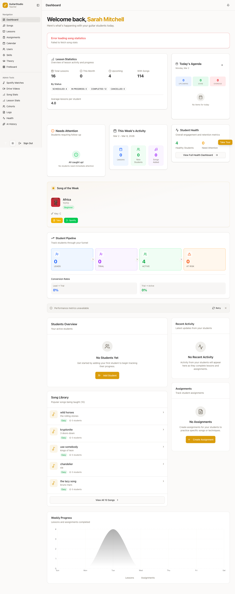
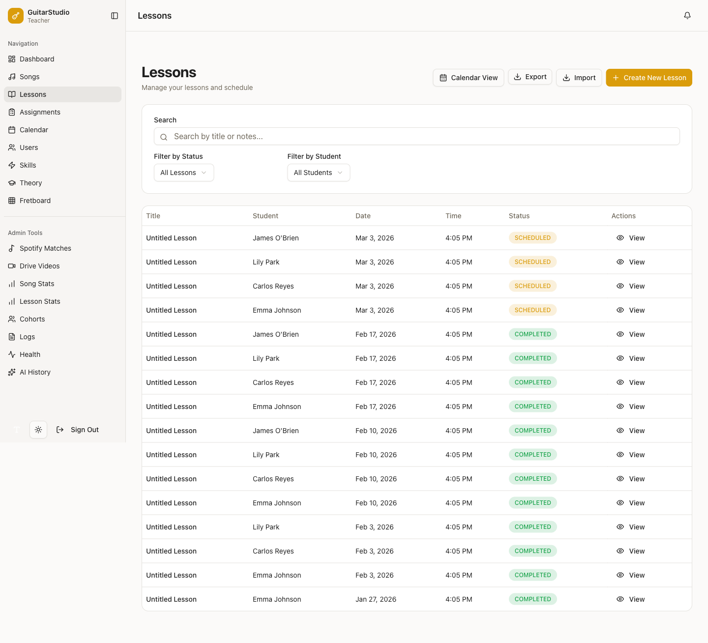
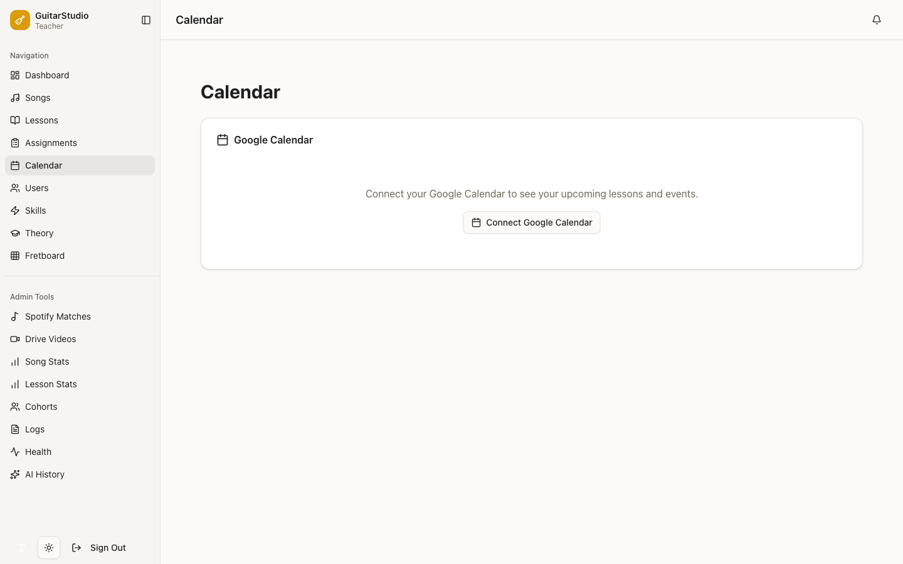
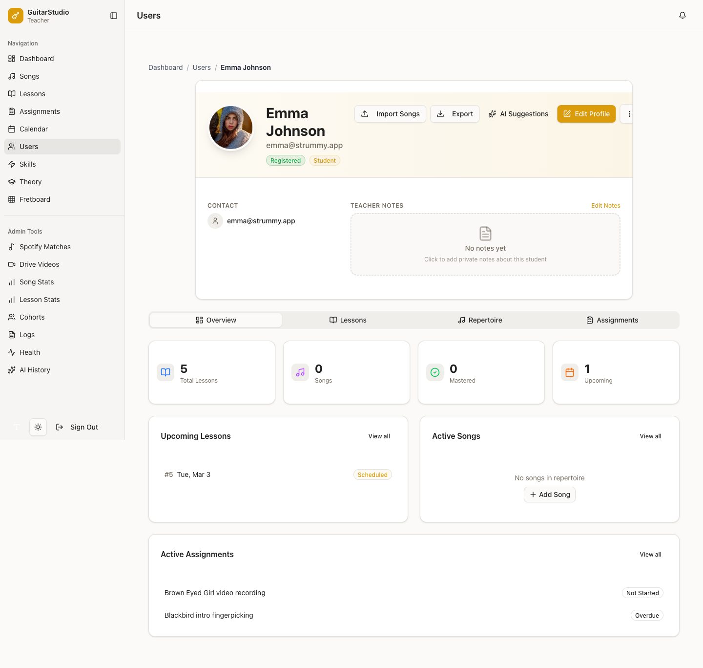
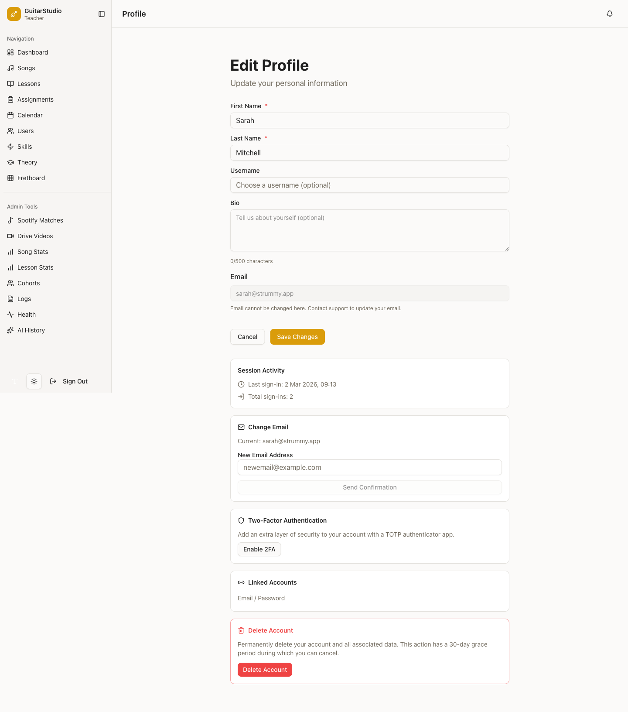

# Strummy — Guitar Teacher CRM

[](https://github.com/PiotrRomanczuk/guitar-crm/actions)
[](https://nextjs.org)
[](https://supabase.com)
[](https://typescriptlang.org)
[](https://strummy.app)

A production SaaS platform for independent guitar teachers — student management, AI-generated lesson content, Spotify-enriched song library, Google Calendar sync, and automated notification pipelines. Built solo over 4 months with **1,150+ commits**, **100 merged PRs**, **30 tagged releases**, and **124 database migrations**.

<p align="center">
  
</p>

---

## Project at a Glance

| Metric | Value |
|:---|:---|
| **Codebase** | ~254,000 lines of TypeScript across 6,900+ source files |
| **API Surface** | 107 REST endpoints + 30 Server Actions |
| **Database** | 124 SQL migrations, 50+ RLS policies, 15+ tables, 13 custom enum types |
| **Testing** | 1,021 test files (Jest unit/integration + Playwright E2E) |
| **CI/CD** | 11-job GitHub Actions pipeline with automated semantic versioning |
| **External Integrations** | 8 services (Supabase, Spotify, Google Calendar, Drive, Gmail, OpenRouter, Ollama, Sentry) |
| **Background Jobs** | 11 Vercel cron endpoints |
| **AI Agents** | 9 domain-specific LLM agents with fallback templates |
| **Components** | 46 shadcn/ui primitives + 94 domain-organized component directories |

---

## Engineering Challenges (The Hard Parts)

This section highlights the problems that were genuinely difficult to solve — the ones that required architectural thinking, not just plugging in a library.

### 1. Multi-Provider AI Abstraction with Agent Registry

**Problem:** The app needs AI for 9 different tasks (lesson notes, assignments, song normalization, progress insights, etc.), each with different prompts, context requirements, and output formats. It must work with cloud LLMs (OpenRouter) in production and local LLMs (Ollama) in development, with seamless failover between them.

**Solution:** A provider factory with an `auto` mode that tries local-first and falls back to cloud. On top of that, a full agent registry where each agent (e.g., `lesson-notes-assistant`, `song-normalization`) has its own specification, validation, permission checks, per-role rate limiting (Admin: 100/min, Teacher: 50/min, Student: 20/min), context-fetching strategy, and analytics logging.

**The tricky part:** When AI is unavailable (both providers down, rate limit exceeded, or network issues), the system can't just fail — teachers are mid-lesson. Every agent has **fallback Markdown templates** that return structured, useful content so the UI never breaks. The queue manager handles batching with concurrency control, and streaming analytics track response quality in real-time to detect degradation before users notice.

**Key files:** `lib/ai/provider-factory.ts`, `lib/ai/registry/`, `lib/ai/queue-manager.ts`, `lib/ai/streaming-analytics.ts`

---

### 2. Spotify Integration with Circuit Breaker Pattern

**Problem:** Spotify's API is rate-limited, tokens expire, and the service occasionally returns 5xx errors. The app needs to match ~500 songs in a teacher's library against Spotify's catalog, where song titles in the DB are often typo-ridden, abbreviated, or use non-standard naming.

**Solution:** A production-grade HTTP client with:
- **Circuit breaker** — opens after 5 consecutive failures, auto-resets after 60 seconds, preventing cascade failures
- **Exponential backoff with jitter** — 1s, 2s, 4s... up to 32s max, preventing thundering herd on recovery
- **Rate limit awareness** — reads `Retry-After` header and waits the exact duration
- **Token lifecycle** — in-memory cache with 60-second expiry buffer, automatic refresh on 401
- **Request timeout** — 30-second `AbortController` to prevent hanging connections

**The tricky part:** Fuzzy matching. A song titled "Nthng Else Mttrs" needs to match "Nothing Else Matters" by Metallica. The solution chains an AI normalization agent (cleans the title) with multiple search query variants (up to 8 strategies per song), then scores results using Levenshtein-based string similarity with a configurable confidence threshold. The entire pipeline streams progress via SSE so teachers see real-time match results.

**Key files:** `lib/spotify.ts`, `lib/services/ai-song-matching.ts`, `lib/services/enhanced-spotify-search.ts`, `lib/utils/string-similarity.ts`

---

### 3. Event-Driven Notification Pipeline

**Problem:** Teachers need automated lesson reminders, assignment due dates, weekly digests, and student progress alerts — delivered via email or in-app, respecting user preferences, without spamming, and with resilience against email delivery failures.

**Solution:** A 6-layer event-driven architecture:

```
DB Triggers  -->  notification_queue table  -->  Cron processor  -->  Dual-channel router
                                                                       |           |
                                                                    Email       In-App
                                                                       |
                                                              Retry handler + Dead letter queue
                                                                       |
                                                              Bounce tracker + Rate limiter
```

1. **PL/pgSQL triggers** fire on lesson/assignment/progress events, building JSONB payloads and inserting into `notification_queue`
2. **Priority queue** with `scheduled_for`, `max_retries`, and `retry_count` fields
3. **Cron processor** drains the queue on schedule, routing each notification through user preference checks
4. **Dual-channel delivery** — email (18 Nodemailer HTML templates) or in-app (Supabase Realtime)
5. **Exponential backoff retry** with dead letter queue after max retries
6. **Bounce handler** tracks failed addresses and disables delivery; **rate limiter** enforces per-user and system-level caps

**The tricky part:** The 445-line trigger migration (`033_notification_triggers.sql`) was the most complex single file in the project. Each trigger must construct the right template data, handle edge cases (lesson cancelled vs. rescheduled vs. moved to different time), and avoid duplicate notifications (30-minute deduplication window for lesson recaps).

**Key files:** `supabase/migrations/033_notification_triggers.sql`, `lib/services/notification-service.ts` (487 lines), `lib/email/retry-handler.ts`, `lib/email/bounce-handler.ts`, `lib/email/rate-limiter.ts`

---

### 4. Row-Level Security at Scale

**Problem:** Three roles (Admin, Teacher, Student) with fundamentally different data visibility. A teacher should only see their own students. A student should only see songs assigned to them. An admin sees everything. This must be enforced at the database layer, not in application code — a single missing `WHERE` clause in any query shouldn't leak data.

**Solution:** 50+ RLS policies across 15+ tables, using PL/pgSQL helper functions (`is_admin()`, `is_teacher()`, `is_student()`) that read from the JWT claims. The policies are layered:

- **Profiles:** Users see their own profile; admins see all
- **Lessons:** Teachers see lessons they created; students see lessons they're assigned to
- **Songs:** Teachers see all songs; students see songs only through a 3-table JOIN (`songs -> lesson_songs -> lessons`) — if a song isn't in any of their lessons, it's invisible
- **Assignments:** Scoped to teacher-student relationships
- **Audit log:** Only admins can read; writes are via `SECURITY DEFINER` triggers (bypasses RLS so the trigger can always write)

**The tricky part:** The student song visibility policy required a multi-table JOIN inside a policy expression, which PostgreSQL evaluates on every row access. Getting this performant required composite indexes and careful query planning. Additionally, soft-deleted songs had an RLS leak — deleted songs were still visible through the join until a dedicated migration fixed the policy to check `deleted_at IS NULL`.

**Key files:** `supabase/migrations/022_rls_policies.sql` (50+ policies), `supabase/migrations/004_functions_base.sql`, security audit migrations (`20260224_*`)

---

### 5. Bidirectional Google Calendar Sync with Conflict Resolution

**Problem:** Teachers manage lessons in Strummy but live in Google Calendar. Changes can happen on either side. A bulk historical import of months of past lessons needs to stream progress to the UI without blocking.

**Solution:**
- **OAuth2 flow** with token refresh for each teacher
- **Webhook subscriptions** with automatic renewal via cron job, validated by `X-Goog-Channel-Token`
- **SSE streaming** for bulk imports: month-chunked pagination of Google Calendar API (250 events/page), streaming events like `init`, `month_start`, `event_imported`, `event_skipped`, `event_error`, `complete`
- **Conflict resolver** that handles the classic sync problem: what happens when a lesson is modified in both Strummy and Google Calendar between syncs?
- **Cancellable streams** — a `DELETE` endpoint accepts a `syncId` to abort an in-progress import, with ownership verification

**The tricky part:** The `ReadableStream` SSE implementation stores an `AbortController` per sync session in a module-level `Map`. When a user cancels, the controller is retrieved by `syncId` prefix, aborted, and cleaned up. Getting the streaming lifecycle right (especially cleanup on client disconnect vs. explicit cancellation vs. error) required careful engineering.

**Key files:** `app/api/calendar/sync/stream/route.ts`, `lib/services/sync-conflict-resolver.ts`, `app/api/cron/renew-webhooks/route.ts`

---

### 6. Security Hardening (Two Dedicated Audit Sprints)

**Problem:** A production app handling student PII with three auth roles, 8 external API integrations, and 107 API endpoints has a large attack surface.

**What was found and fixed (17+ tracked issues across two sprints):**

| Vulnerability | Fix |
|:---|:---|
| IDOR in email unsubscribe links | Replaced plain `userId` with HMAC-signed tokens |
| PostgREST filter injection in song search | Parameterized all filter inputs |
| `getSession()` used in middleware (client-forgeable) | Migrated to `getUser()` (server-verified) |
| Service role key exposed via `NEXT_PUBLIC_` prefix | Moved to server-side only env vars |
| Missing CSP headers | Full Content Security Policy with Supabase, Spotify CDN, Google, Sentry allowlisting |
| RLS leak on soft-deleted songs | Added `deleted_at IS NULL` to student visibility policies |
| Unauthenticated debug routes in production | Gated behind admin role check |
| Missing webhook token validation | Added `X-Goog-Channel-Token` verification |
| N+1 queries in admin analytics | Replaced `select('*')` with explicit column lists |

**Key files:** Security audit migrations (`supabase/migrations/20260224_*`), `middleware.ts` (CSP + security headers), `lib/auth/cron-auth.ts`

---

## Skills Demonstrated & Growth Areas

This project pushed my abilities across multiple engineering disciplines:

| Skill Area | What I Built | What I Learned |
|:---|:---|:---|
| **System Design** | Multi-layer architecture: App Router + Server Actions + REST API + background jobs + event-driven pipelines | How to decompose a monolith into clear layers without over-engineering; when to use Server Actions vs. API routes vs. cron jobs |
| **Database Engineering** | 124 migrations, materialized views, PL/pgSQL triggers, atomic rate limiting via advisory locks, audit log with JSON diffs | Writing performant RLS policies (multi-JOIN in policy expressions), managing migration drift across environments, designing trigger-based event systems |
| **API Integration Patterns** | Circuit breaker, exponential backoff with jitter, token caching, SSE streaming, webhook lifecycle management | Resilience engineering — building systems that degrade gracefully instead of failing catastrophically; handling every edge case in OAuth2 token lifecycle |
| **Security Engineering** | HMAC token signing, CSP headers, RLS audit, injection prevention, RBAC at 3 layers (DB/middleware/component) | Thinking like an attacker — the IDOR and filter injection vulnerabilities were only found by systematically auditing every user-controlled input path |
| **AI/LLM Integration** | Multi-provider factory, agent registry, streaming responses, fallback templates, per-role rate limiting | Designing AI features that work when AI is unavailable; prompt engineering for structured outputs; token estimation for cost control |
| **Testing Strategy** | 1,021 test files, 3-layer pyramid (unit/integration/E2E), MSW for API mocking, Playwright across 7 device profiles | Writing meaningful E2E tests (user journeys, not UI snapshots); mocking Supabase at the right layer; integration test infrastructure design |
| **DevOps & CI/CD** | 11-job pipeline, automated semantic versioning from branch names, preview deployments per PR, database migration deployment | Building CI that catches real issues (security audit + DB schema check as blocking gates) vs. CI that just runs tests |
| **Real-Time Systems** | SSE streaming for calendar/Spotify sync, Supabase Realtime for notifications, cancellable long-running operations | Managing streaming lifecycle (cleanup on disconnect, explicit cancel, error); module-level state for tracking active streams |

---

## Technology Stack

| Layer | Technology | Why This Choice |
|:---|:---|:---|
| **Framework** | Next.js 16, React 19 | App Router for RSC/streaming; Server Actions reduce API boilerplate |
| **Styling** | Tailwind CSS 4, shadcn/ui, Framer Motion | 46 Radix-based primitives; mobile-first with dark mode |
| **Database** | PostgreSQL via Supabase | RLS for multi-tenant security; Realtime for live notifications |
| **Auth** | Supabase Auth + Google OAuth | Three-role RBAC enforced at DB layer, not just app layer |
| **AI** | OpenRouter (cloud) + Ollama (local) | Cloud for production reliability; local for privacy and dev speed |
| **Integrations** | Spotify, Google Calendar, Google Drive, Gmail SMTP | Song metadata enrichment, scheduling sync, video library, email delivery |
| **Validation** | Zod | Runtime type safety at all API boundaries; shared schemas between client/server |
| **Monitoring** | Sentry, Vercel Analytics | Error tracking with source maps; Web Vitals and custom event tracking |
| **Testing** | Jest + Playwright | Unit/integration mocked via MSW; E2E uses real services across 7 device profiles |
| **Charts** | Nivo, Recharts | Analytics dashboards with calendar heatmaps, bar charts, sunburst diagrams |
| **Audio** | Tone.js | Guitar audio synthesis for the interactive fretboard tool |

---

## Architecture

```
                                      +------------------+
                                      |   Vercel Edge    |
                                      |   (Middleware)   |
                                      |  Auth + CSP +    |
                                      |  RBAC gating     |
                                      +--------+---------+
                                               |
                    +--------------------------+---------------------------+
                    |                          |                           |
            +-------+-------+         +-------+-------+          +--------+--------+
            |  App Router   |         |  API Routes   |          | Server Actions  |
            |  (RSC + SSR)  |         |  (107 endpoints)|        | (30 actions)    |
            +-------+-------+         +-------+-------+          +--------+--------+
                    |                          |                           |
                    +--------------------------+---------------------------+
                                               |
                    +--------------------------+---------------------------+
                    |                          |                           |
            +-------+-------+         +-------+-------+          +--------+--------+
            |   Services    |         |   AI Layer    |          |   Integrations  |
            | (15 domain    |         | (Provider     |          | (Spotify,       |
            |  services)    |         |  Factory +    |          |  Calendar,      |
            |               |         |  9 Agents)    |          |  Drive, SMTP)   |
            +-------+-------+         +-------+-------+          +--------+--------+
                    |                          |                           |
                    +--------------------------+---------------------------+
                                               |
                              +----------------+----------------+
                              |         Supabase               |
                              |  PostgreSQL + RLS + Realtime   |
                              |  50+ policies | 124 migrations |
                              |  Triggers -> Notification Queue|
                              +---------------------------------+
                                               |
                              +----------------+----------------+
                              |    Background Processing       |
                              |  11 Vercel Cron Jobs           |
                              |  Queue processor | Webhooks    |
                              |  Drive scanner | Digest emails |
                              +---------------------------------+
```

### Directory Structure

```
guitar-crm/
  app/
    (auth)/                 # Route group: sign-in, sign-up, forgot-password, invitations
    actions/                # 30 Server Actions (AI, songs, lessons, users, email)
    api/                    # 107 REST endpoints organized by domain
      ai/                   #   AI playground, debug, chat streaming
      calendar/             #   Google Calendar sync, webhooks, SSE streaming
      cron/                 #   11 background jobs (reminders, digests, scanners)
      spotify/              #   Search, sync, match approval with circuit breaker
      admin/                #   User management, drive videos, stats
    dashboard/              # Protected pages (admin, teacher, student views)
    onboarding/             # Multi-step onboarding flow
  components/               # 94 domain directories, Parent.Section.tsx naming
  lib/
    ai/                     # Provider factory, agent registry, queue, streaming
    email/                  # 18 templates, retry handler, bounce tracker, rate limiter
    services/               # 15 domain services (notification, calendar sync, matching)
    supabase/               # DB clients, helpers, dual-connection routing
  schemas/                  # 36 Zod validation schemas
  supabase/migrations/      # 124 SQL files (schema, RLS, triggers, functions)
  __tests__/                # Jest tests mirroring source structure
  tests/e2e/                # Playwright specs across 7 device profiles
  .github/workflows/        # 4 workflows (CI/CD, versioning, AI code review)
  .claude/agents/           # 15 specialized AI agent specifications
```

---

## Screenshots

### Dashboard & Analytics
Teacher overview with live notifications, today's agenda, student health indicators, and Nivo performance charts.


### Song Library
Spotify-enriched catalog with album art, difficulty badges, musical key metadata, and per-student filtering.


### Lesson Management
Searchable, sortable table with status filters, bulk import/export, and AI-generated lesson notes.



### Calendar & Scheduling
Monthly view with color-coded lesson density, daily agenda, and bidirectional Google Calendar sync.



### Student Profiles
Per-student detail page with repertoire tracking, lesson history, and PDF/Excel export.



### Profile & Account Security
2FA (TOTP), session activity tracking, Google OAuth linking, and account deletion with 30-day grace period.



---

## Quick Start

```bash
# Clone and install
git clone https://github.com/PiotrRomanczuk/guitar-crm.git
cd guitar-crm && npm install

# Configure environment
cp .env.example .env.local
# Minimum: NEXT_PUBLIC_SUPABASE_REMOTE_URL + NEXT_PUBLIC_SUPABASE_REMOTE_ANON_KEY

# Set up database and seed demo data
npm run setup:db && npm run seed

# Launch
npm run dev    # http://localhost:3000
```

Demo accounts after seeding:
- **Admin:** `p.romanczuk@gmail.com` / `test123_admin`
- **Teacher:** `teacher@example.com` / `test123_teacher`
- **Student:** `student@example.com` / `test123_student`

---

## CI/CD Pipeline

Every push triggers an 11-job GitHub Actions pipeline:

```
Push/PR
  |
  +-- Lint + TypeScript strict check
  +-- Jest unit tests (coverage threshold enforced)
  +-- Jest integration tests
  +-- Next.js production build
  +-- Supabase schema diff + quality check
  +-- Security audit (npm audit + secret detection)
  +-- Playwright E2E (Desktop Chrome, on PRs only)
  |
  +-- Quality Gate (aggregates all jobs — fails if any fail)
  |
  +-- Deploy database migrations (main/production branches)
  +-- Deploy to Vercel (preview for main, production for production branch)
```

**Automated versioning:** On merge to `main`, the `version-bump.yml` workflow reads the branch prefix (`feature/` = minor, `fix/` = patch), creates an annotated git tag, and generates a GitHub Release with the PR description as release notes.

---

## Documentation

| Guide | Description |
|:---|:---|
| [ARCHITECTURE.md](./docs/ARCHITECTURE.md) | System design, RBAC model, database schema |
| [DEVELOPMENT.md](./docs/DEVELOPMENT.md) | Local setup, Git workflow, CI/CD |
| [AI_SYSTEM.md](./docs/AI_SYSTEM.md) | AI provider architecture, agent specifications |
| [NOTIFICATION_SYSTEM.md](./docs/NOTIFICATION_SYSTEM.md) | Email + in-app notification pipeline |
| [GOOGLE_CALENDAR_INTEGRATION.md](./docs/GOOGLE_CALENDAR_INTEGRATION.md) | Calendar sync, webhooks, conflict resolution |
| [API_REFERENCE.md](./docs/API_REFERENCE.md) | REST API and Server Actions reference |
| [TESTING.md](./docs/TESTING.md) | Testing strategy and coverage targets |

---

## Deployment

| Branch | Environment | URL |
|:---|:---|:---|
| `main` | Preview / Staging | Vercel auto-deploy |
| `production` | Production | [strummy.app](https://strummy.app) |

---

*Solo-built over 4 months. 1,150+ commits. 100 PRs. 30 releases. Still shipping.*
