# AI Agent Workflow & Integration Points

This document visualizes the technical path of the AI Agent and identifies the key touchpoints where the AI integrates into the user's workflow within Guitar CRM.

## 1. Technical Agent Path

This graph illustrates the data flow from the user's input through the system architecture to the AI model and back.

```mermaid
graph TD
    %% Nodes
    User([👤 User])
    UI[💻 Dashboard UI<br/>(AIAssistantCard)]
    Server[⚙️ Server Action<br/>(app/actions/ai.ts)]
    Auth[🔐 Auth & Validation]
    Config[xB6 Configuration<br/>(lib/ai-models.ts)]
    OpenRouter[🌐 OpenRouter API]
    LLM[🤖 AI Model<br/>(Llama 3.3 / DeepSeek / etc.)]

    %% Flow
    User -->|1. Types Prompt| UI
    UI -->|2. Selects Model| UI
    UI -->|3. POST Request| Server
    
    subgraph Backend Layer
    Server -->|4. Retrieve API Key| Auth
    Server -->|5. Get Model Config| Config
    Auth -->|6. Validated Request| OpenRouter
    end
    
    subgraph External AI Service
    OpenRouter -->|7. Route Request| LLM
    LLM -->|8. Generate Response| OpenRouter
    end
    
    OpenRouter -->|9. JSON Response| Server
    Server -->|10. Return Data| UI
    UI -->|11. Render Markdown| User

    %% Styling
    style User fill:#f9f,stroke:#333,stroke-width:2px
    style LLM fill:#bbf,stroke:#333,stroke-width:2px
    style Server fill:#dfd,stroke:#333,stroke-width:2px
```

## 2. User Journey Integration Points

This journey map highlights specific moments in the application usage where the AI Assistant provides value.

```mermaid
journey
    title AI Assistant Touchpoints in Guitar CRM
    section 1. Dashboard & Overview
      Log in to Admin Panel: 5: User
      Check Quick Stats: 5: User
      ❓ Ask AI: "Summarize recent activity": 4: AI
    section 2. Student Management
      View Student Profile: 5: User
      ❓ Ask AI: "Draft a progress report for this student": 5: AI
    section 3. Lesson Planning
      Open Lesson Editor: 4: User
      ❓ Ask AI: "Suggest exercises for beginner chords": 5: AI
      Save Lesson Notes: 5: User
    section 4. Communication
      Need to send payment reminder: 3: User
      ❓ Ask AI: "Write a polite payment reminder email": 5: AI
      Send Email: 5: User
    section 5. System Support
      Confused about a feature: 2: User
      ❓ Ask AI: "How do I add a new song to the library?": 5: AI
```



## 3. Integration Contexts

### A. The "Always-On" Assistant (Current)
*   **Location:** Admin Dashboard (`/dashboard`).
*   **Context:** General purpose. The AI is a "sidecar" tool that sits alongside your main work.
*   **Use Case:** Quick questions, brainstorming, and general support without leaving the main view.

### B. Context-Aware Actions (Planned)
*   **Location:** Specific pages (e.g., Lesson Editor, Student Profile).
*   **Context:** The AI will eventually be aware of the *current page data*.
*   **Use Case:**
    *   *On Student Page:* "Draft an email to **this student**." (AI reads the student's name/email).
    *   *On Lesson Page:* "Generate homework based on **this lesson's** topic."

### C. Background Automation (Future)
*   **Location:** Server-side jobs.
*   **Context:** Invisible to the user until complete.
*   **Use Case:**
    *   Auto-tagging new songs added to the library.
    *   Weekly summary emails generated automatically on Sunday nights.
